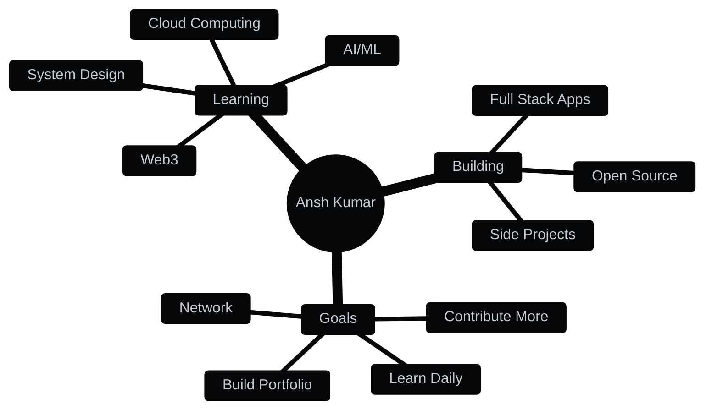

<div align="center">
  
  
  
  
  
</div>

<br>

<div align="center">
  
</div>

<br>

<h2 align="center">💡 About Me</h2>

```typescript
const Albez0 = {
    name: "Ansh Kumar",
    role: "Software Developer",
    location: "127.0.0.1 🌐",
    mindset: "KNOW-IT-ALL 🧠",
    pronouns: "He/Him",
    code: ["JavaScript", "TypeScript", "Python", "Java"],
    technologies: {
        frontend: ["React", "TailwindCSS"],
        backend: ["Node.js", "Express"],
        database: ["MongoDB", "PostgreSQL", "MySQL"],
        tools: ["Git", "Linux", "VS Code"],
        learning: ["AI/ML", "Web3", "Cloud Computing", "DevOps"]
    },
    currentFocus: "Building impactful projects 🚀",
    funFact: "I debug with console.log() 😅"
};
```

<br>

<div align="center">
  
  [](https://github.com/Albez0-An7h)
  [](https://github.com/Albez0-An7h)
  
</div>

---

<h2 align="center">⚡ Quick Facts</h2>

<div align="center">

```yaml
🔭 I'm currently working on: Web Applications & Cool Projects
🌱 I'm currently learning: Advanced Programing & System Design
👯 I'm looking to collaborate on: Open Source Projects
💬 Ask me about: JavaScript, React, Python, Java
📫 How to reach me: LinkedIn or Discord
⚡ Fun fact: Actual asteroids in actual space named after Linux ✨
```

</div>

---

<h2 align="center">🛠️ Tech Stack & Tools</h2>

<div align="center">

### Languages


### Frameworks & Libraries


### Databases & Tools


### DevOps & Others


</div>

<br>

<div align="center">
  
</div>

---

<h2 align="center">📊 GitHub Analytics</h2>

<div align="center">
  
  
</div>

<div align="center">
  
  
</div>

<br>

<div align="center">
  
</div>

---

<h2 align="center">🏆 GitHub Achievements</h2>

<div align="center">
  
</div>

<br>

<div align="center">
  
</div>

---

<h2 align="center">🎯 Current Focus</h2>

<div align="center">



</div>

---

<h2 align="center">🐍 Contribution Snake</h2>

<div align="center">
  <picture>
    <source media="(prefers-color-scheme: dark)" srcset="https://raw.githubusercontent.com/Albez0-An7h/Albez0-An7h/output/github-contribution-grid-snake-dark.svg">
    <source media="(prefers-color-scheme: light)" srcset="https://raw.githubusercontent.com/Albez0-An7h/Albez0-An7h/output/github-contribution-grid-snake.svg">
    
  </picture>
</div>

---

<h2 align="center">🤝 Let's Connect</h2>

<div align="center">
  
  <a href="https://www.linkedin.com/in/ansh-kumar-723696305/" target="_blank">
    
  </a>
  <a href="https://discord.com/users/742213375651610726" target="_blank">
    
  </a>
  <a href="mailto:ansh.km7096@gmail.com" target="_blank">
    
  </a>
  
</div>

<br>

<div align="center">
  
### 📬 Feel free to reach out for:
  
🤝 Collaborations • 💡 Ideas • 🐛 Bug Reports • 🎯 Opportunities
  
</div>

---

<div align="center">

<h3>💭 Dev Quote</h3>
  


<h3>😂 Random Dev Meme</h3>


</div>

---

<div align="center">
  
### 📈 Profile Stats
  


<br>


</div>
